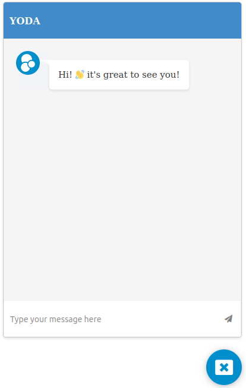

# YODA Chatbot

Yoda Chabot contains the source code for using and displaying Eden AI Yoda Chatbot in your website. The repository contains two branches: **main** and **embed**. The former holds the `iframe` source code, and it's deplyed on github pages. The latter holds the `embed` code for using the *chatbot* in your website. We will describe each of the `branches` content here after.

### YODA Chatbot iframe (main branch)



The main branch contains essentially the `iframe` source code for displaying the ChatBot in the bottom right corner of the user website.

### YODA Chatbot embed code (embed branch)

The YODA Chatbot embed branch contains the javascript code minified that allows the create and display an `iframe` holding the **YODA Chatbot** in your website for your users.

## Usability

To be able to use `Eden AI YODA Chatbot` you have to:
- Create an [`Ask Yoda`](https://docs.edenai.co/docs/ask-yoda) project.
- Upload your data either from a *file*, a *text content* or from an *url*.
- Copy this code into your HTML body:
```javascript
<script src="https://cdn.jsdelivr.net/gh/edenai/yodabot@b05ff5f/embed.js?project={project_id}"></script>
```
- change the *project_id* with your `project uuid` available in your *Ask Yoda* project.
- Users accessing your website will now be able to use your trained YODA Chatbot and ask their questions and receive responses depending on data the Chatbot had been training on.
