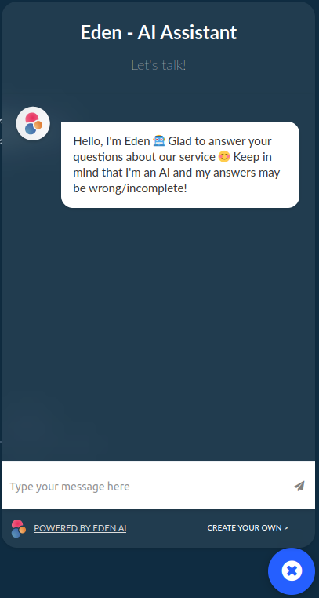

<!-- markdown-toc start - Don't edit this section. Run M-x markdown-toc-refresh-toc -->
**Table of Contents**

- [🌟 Custom Chatbot (RAG)](#-custom-chatbot-rag)
  - [🌐 Chatbot iframe (main branch)](#-chatbot-iframe-main-branch)
  - [💻 Chatbot embed code (embed branch)](#-chatbot-embed-code-embed-branch)
  - [🚀 Usability](#-usability)
    - [1. Create an `Custom ChatBot RAG`Project:](#1-create-an-custom-chatbot-rag-project)
    - [2. Copy the Code:](#2-copy-the-code)
    - [3. Replace Parameters:](#3-replace-parameters)
    - [4. Add Optional Parameters:](#4-add-optional-parameters)
    - [5. Example URL:](#5-example-url)
    - [6. Deploy:](#6-deploy)
<!-- markdown-toc end -->

# 🌟 Custom Chatbot (RAG)

Welcome to the Chatbot repository! This repository contains the source code for integrating and displaying the Eden AI Custom Chatbot on your website. The repository is divided into two branches: **main** and **embed**. The **main** branch holds the `iframe` source code, while the **embed** branch contains the `embed` code for using the chatbot on your website. Let's dive into the details of each branch.

### 🌐 Chatbot iframe (main branch)



The **main** branch contains the `iframe` source code for displaying the ChatBot in the bottom right corner of your website.

### 💻 Chatbot embed code (embed branch)

The **embed** branch contains the minified JavaScript code that allows you to create and display an `iframe` holding the **Custom Chatbot** on your website for your users.

## 🚀 Usability

To use the `Eden AI Custom Chatbot`, follow these steps:

1. **Create an [`Custom ChatBot RAG`](https://docs.edenai.co/docs/ask-yoda) Project:**
   - Upload your data from a *file*, *text content*, or an *URL*.

2. **Copy the Code:**
   - Copy this code into your HTML body:
   ```html
   <script src="https://cdn.jsdelivr.net/gh/edenai/yodabot@0dc64f2/embed.js?project={project_id}&provider={your_llm_provider}&model={your_llm_model}&k={k}"></script>
   ```

3. **Replace Parameters:**
   - Replace `{project_id}` with your `project uuid` available in your *Custom ChatBot* project.
   - Optionally, provide the `llm_provider`, `llm_model`, and the parameter `k`.

4. **Add Optional Parameters:**
   - **title:** Define a title to replace the default title.
   - **message:** Define a message to appear first in the chat.
   - **color:** Change the logo’s color. You can enter “red”, “black”, “blue”, etc., or use color codes like “#FF0000”. **Note:** The color parameter must be the last parameter in the URL.

5. **Example URL:**
   ```html
   <script src="https://cdn.jsdelivr.net/gh/edenai/yodabot@0dc64f2/embed.js?project={project_id}&provider=mistral&model=small&k=1&title=my customized bot&message=hello i’m customized bot&color=red"></script>
   ```

6. **Deploy:**
   - Users accessing your website will now be able to use your trained Chatbot, ask questions, and receive responses based on the data the Chatbot has been trained on.

---

By following these steps, you can seamlessly integrate the Custom Chatbot into your website, enhancing user engagement and providing valuable insights into customer interactions. 🌟
